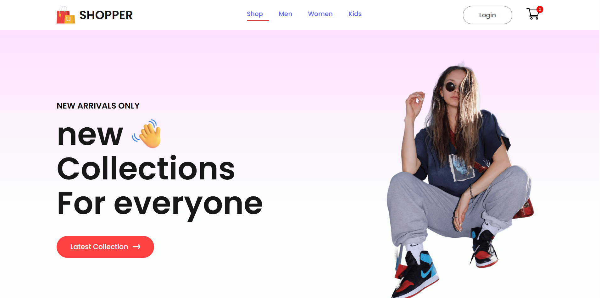
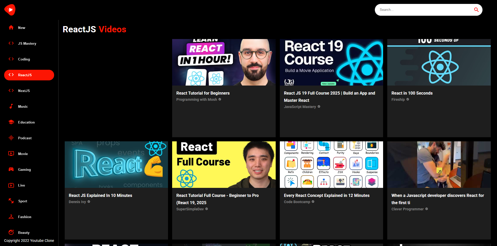

# Frontend Projects Showcase
A curated list of my deployed frontend projects built using
**React, Next.js, JavaScript, APIs, and modern UI practices**.

---

## 🚀 Deployed Projects

| Project Name | Tech Stack | Live Demo | Source Code |
|-------------|-----------|-----------|-------------|
| Ecommerce | React, API | [Live](https://ecommerce-shopper-irfan.netlify.app/) | [Repo](https://github.com/Irfanft12/spotify-clone) |
| YouTube Clone | React, Context | [Live](https://react-youtube-clone-irfan.netlify.app/) | [Repo](https://github.com/Irfanft12/react-youtube-clone) |
| Reasl Estate Website | Next.js | [Live](https://nextjs-real-estate.vercel.app/) | [Repo](https://github.com/Irfanft12/nextjs-real-estate) |
| Ecommerce | Next.js | [Live](https://next-ecommerce-irfan.vercel.app/) | [Repo](https://github.com/Irfanft12/next-ecommerce-jsmastery) |
| Admin Dashboard | React, Charts | [Live](https://react-js-syncfusion-dashboard.netlify.app/) | [Repo](https://github.com/Irfanft12/react-syncfusion-dashboard) |

## 🛠 Tech Stack

- React.js
- Next.js
- JavaScript (ES6+)
- REST APIs
- CSS / Tailwind / MUI
- Netlify / Vercel / GitHub Pages

---

## 📌 About Me

Frontend Developer focused on building and deploying real-world applications.

